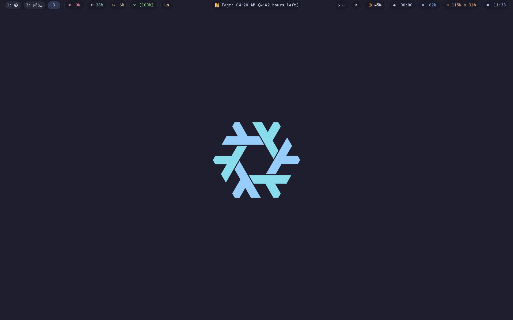
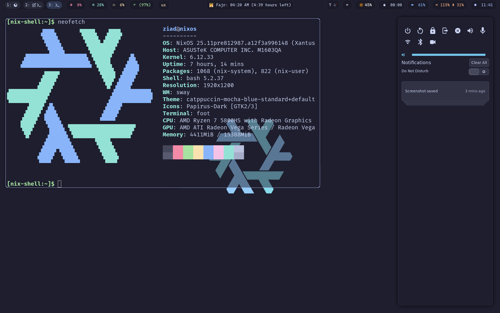

# NixOS Desktop Environment

A reproducible workstation built around NixOS + Home Manager with dual desktops (GNOME + SwayFX), Stylix-driven Catppuccin theming, and automation scripts that cover daily productivity, development, and worship routines.

---

## Table of Contents

1. [Highlights](#highlights)
2. [Repository Layout](#repository-layout)
3. [Desktop Profiles](#desktop-profiles)
   - [GNOME (default)](#gnome-default)
   - [Sway Specialisation](#sway-specialisation)
4. [Home Manager Layers](#home-manager-layers)
5. [Custom Packages](#custom-packages)
6. [Automation & Tooling](#automation--tooling)
7. [Getting Started](#getting-started)
8. [Daily Operations](#daily-operations)
9. [Maintenance](#maintenance)
10. [Screenshots](#screenshots)

---

## Highlights

- **Dual desktop stack**: GNOME via GDM for a traditional workflow, and a SwayFX specialisation launched through greetd/tuigreet.
- **Wayland-first UX**: Waybar, SwayNC, cliphist, autotiling, GTKLock, and UWSM deliver a cohesive tiling experience.
- **Stylix theming**: Catppuccin Mocha palette with Papirus icons, Catppuccin cursors, and Nerd Fonts baked in.
- **Developer-ready**: Helix and Zed with LSP backends (nil, nixd, clangd), uv, nix-search-tv, lazygit, direnv/nix-direnv.
- **Automation suite**: Prayer notifications, pomodoro integration, git-helper, video compression helper, and power-safe rebuild aliases.
- **Virtualisation**: Docker, libvirt, virt-manager, SPICE USB redirection, autotiling-friendly monitors.

---

## Repository Layout

```text
nixos/
├── configuration.nix          # System entry point (imports HM + overlays)
├── hardware-configuration.nix # Generated hardware profile
├── home.nix                   # Base Home Manager module (GNOME baseline)
├── sway.nix                   # Sway-specific Home Manager augmentation
├── sway-system.nix            # System overrides for sway specialisation
├── prayer-notify.nix          # User timers & scripts for prayer alerts
├── pkgs/                      # Overlay with bilal, pomodoro-cli, git-helper...
├── dotfiles/                  # Waybar, SwayNC, sworkstyle, screenshot assets
├── scripts/                   # Shell helpers (compress.sh, git-helper.sh)
└── wallpaper.jpg              # Stylix wallpaper reference
```

---

## Desktop Profiles

### GNOME (default)

- Enabled through `services.displayManager.gdm` and `services.desktopManager.gnome`.
- Stripped-down GNOME with redundant apps removed (tour, maps, contacts, etc.).
- XDG portals prefer `gnome`/`gtk` implementations for consistent file pickers.
- Home Manager base (`home.nix`) configures apps, aliases, and GTK theming.

### Sway Specialisation

- Activated with `sudo nixos-rebuild switch --specialisation sway`.
- System layer (`sway-system.nix`) disables GDM, enables greetd/tuigreet, GTKLock, UWSM, and WLR portals.
- Home layer (`sway.nix`) extends the base profile:
  - SwayFX package with corner radius, gestures, screenshot/OCR bindings.
  - Waybar configuration (CPU/RAM, disk, network, prayer module, Pomodoro, audio idle inhibitor).
  - SwayNC, cliphist, sworkstyle, brightness, DDC control, polkit agent.
  - Environment exports via `uwsm` for Wayland apps.

Key bindings (excerpt):

| Binding | Action |
|---------|--------|
| `Super + d` | Rofi launcher |
| `Super + s` | Region screenshot → clipboard |
| `Super + o` | OCR screenshot to clipboard |
| `Super + v` | Clipboard history (cliphist) |
| `Super + g` | Region screenshot → file |
| `Super + n` | Wayscriber transcription |
| `Super + 1..9` | Switch workspaces |
| `Super + Ctrl + 1..9` | Move container & follow |

---

## Home Manager Layers

1. **Base (`home.nix`)**
   - Packages: productivity (LibreOffice, Obsidian, Xournal++), media (OBS, GIMP, Kooha), comms (Signal wrapper, Telegram), custom utilities (bilal, quran-companion, find_unicode, pomodoro-cli, git-helper).
   - Editors: Helix (auto-formatting for Nix/C), Zed with Catppuccin theme and language extensions.
   - Browsers: Firefox, Ungoogled Chromium.
   - Shell tooling: Starship, bash, eza, direnv/nix-direnv, lazygit, mcfly, uv.
   - XDG desktop entries for Signal, mime overrides (mail, terminal).
   - GTK theming alignment and Stylix overrides (disable Firefox/Zed/Waybar targets for manual styling).
   - `nix-search-tv` configuration with scheduled index refresh.

2. **Sway Overlay (`sway.nix`)**
   - Adds screen capture stack (grim, slurp, wl-clipboard), imv, thunderbird, sway audio inhibitor.
   - Configures swayidle, swaync, waybar, polkit agent, and Wayland environment variables.
   - Ships dotfile bindings via `home.file` for sworkstyle and Waybar CSS.

---

## Custom Packages

| Package | Purpose | Notes |
|---------|---------|-------|
| `bilal` | Prayer times CLI | Rust build pinned to v1.8.0 |
| `next-prayer` | Waybar/GTKLock text | Shell wrapper around `bilal current/next` |
| `find_unicode` | Unicode explorer | Rust CLI, built with `cargoBuildFlags = ["--bins"]` |
| `git-helper` | AI commit assistant | Wraps `scripts/git-helper.sh`, depends on Gemini/OpenRouter auth |
| `pomodoro-cli` | Timer with Waybar hooks | Rust crate with ALSA support |
| `quran-companion` | Desktop Quran app | AppImage wrapped via `appimageTools` |
| `gtklock-runshell-module` | GTKLock widget | Meson build, used to show `next-prayer` |

All definitions live in `pkgs/default.nix` as an overlay injected via `nixpkgs.overlays`.

---

## Automation & Tooling

- **Prayer Notifications (`prayer-notify.nix`)**
  - Creates `schedule_prayers.sh` and `prayer_notify.sh` under `~/.local/share/prayer-notify`.
  - Systemd user service + timer schedules daily notifications per prayer using `bilal`.
  - Avoids duplicate scheduling via a cache marker, cleans existing timers before re-registering.

- **Rebuild Aliases**
  - `build` → `systemd-inhibit --what=idle sudo nixos-rebuild switch`.
  - `build-sway` → same with `--specialisation sway`.

- **Video Compression (`scripts/compress.sh`)**
  - `compress share input.mp4 output.mp4` (CRF 28, 1 Mbps).
  - `compress high ...` (CRF 20, 4 Mbps).
  - Includes help text, sanity checks, and ffmpeg guard.

- **Git Helper (`scripts/git-helper.sh`)**
  - Verifies staged changes, pipes diff into `gemini --yolo`.
  - Generates imperative, conventional summaries with optional body.

- **Waybar Widgets**
  - Pomodoro block polls `pomodoro-cli status` JSON.
  - Prayer block polls `next-prayer` every 30 seconds.
  - Custom HDMI backlight widget uses `ddcutil` scroll bindings.

---

## Getting Started

1. **Configure channels**
   ```bash
   sudo nix-channel --add https://nixos.org/channels/nixos-unstable nixpkgs
   sudo nix-channel --add https://github.com/nix-community/home-manager/archive/master.tar.gz home-manager
   sudo nix-channel --add https://github.com/NixOS/nixos-hardware/archive/master.tar.gz nixos-hardware
   sudo nix-channel --update
   ```

2. **Clone & hardware profile**
   ```bash
   git clone <repository-url> ~/nixos
   sudo nixos-generate-config --show-hardware-config > ~/nixos/hardware-configuration.nix
   ```

3. **Initial build (GNOME)**
   ```bash
   sudo nixos-rebuild switch -I nixos-config=~/nixos/configuration.nix
   ```

4. **Build Sway specialisation**
   ```bash
   sudo nixos-rebuild switch -I nixos-config=~/nixos/configuration.nix --specialisation sway
   ```

---

## Daily Operations

| Task | Command / Notes |
|------|-----------------|
| Boot into GNOME | Default systemd-boot entry |
| Boot into Sway | Select `sway` from boot menu |
| Switch to Sway (hot) | `sudo nixos-rebuild switch --specialisation sway` |
| Return to GNOME | `sudo nixos-rebuild switch` |
| Trigger prayer scheduler | `systemctl --user start prayer-scheduler.service` |
| Check next prayer | `next-prayer` (Waybar/terminal) |
| Start Pomodoro | Waybar click or `pomodoro-cli start --add 5m --notify` |
| Clipboard history | `Super + v` (cliphist + rofi) |
| OCR screenshot | `Super + o` (grim + tesseract + wl-copy) |

---

## Maintenance

```bash
# Update channels & fetch tarballs (Stylix, Home Manager)
sudo nix-channel --update

# Rebuild system (default profile)
build

# Rebuild sway profile
build-sway

# Remove old generations & store paths
sudo nix-collect-garbage -d
```

---

## Screenshots

  


---

**Maintainer**: Ziad Khaled  
**Target release**: `nixos-unstable (26.05)`
