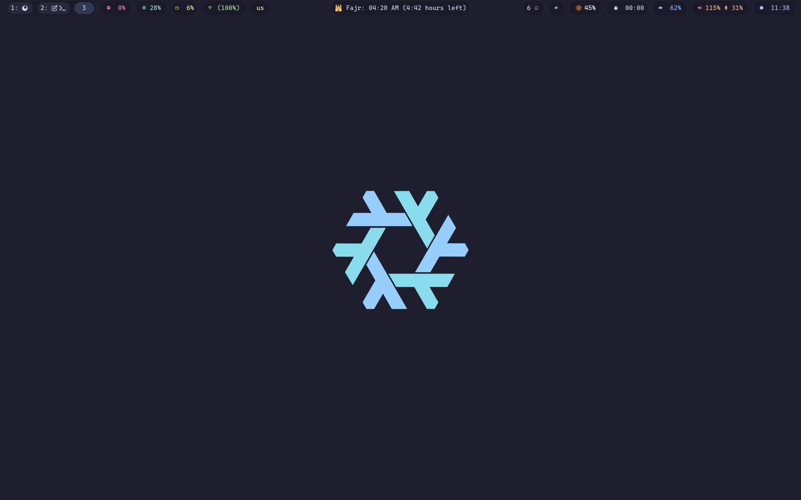

# NixOS Desktop Configuration

A comprehensive NixOS configuration featuring Sway window manager with modern development tools, aesthetic theming, and productivity-focused applications.

## 📸 Screenshots

See the visual result of this configuration:

### Desktop Environment


### Workspace Overview  


## 🌟 Features

### 🪟 Window Management
- **Sway (SwayFX)** - Wayland compositor with eye-candy effects
- **Autotiling** - Automatic window tiling
- **Workspace management** - 9 workspaces with smart switching
- **Corner radius** and **shadows** for modern aesthetics
- **Floating window rules** for dialogs and utilities

### 🎨 Visual & Theming
- **Catppuccin Theme** - Mocha flavor across all applications
- **Waybar** - Highly customized status bar with system monitoring
- **SwayNC** - Notification center with action buttons
- **Custom fonts** - Cascadia Code, Fira Code, Font Awesome, Nerd Fonts
- **Dynamic wallpaper** - Auto-downloaded Catppuccin wallpapers
- **Visual Examples** - See screenshots in `dotfiles/` folder showcasing the complete desktop environment

### 🛠️ Development Environment
- **Multiple editors**:
  - Zed Editor (primary) with Nix support
  - Helix with language servers
  - Neovim and Vim
- **Language servers**: nil, nixd, clang-tools
- **Development tools**: Git with Delta, Fish shell with plugins
- **Package management**: Nix with direnv integration

### 📱 Applications & Utilities
- **Browser**: Firefox with Wayland support
- **Terminal**: Foot terminal with custom styling
- **File manager**: Thunar with archive support
- **Media**: MPV, VLC, Obsidian, XournalPP
- **Productivity**: Pomodoro timer, Papers, Bottom (system monitor)
- **Communication**: Telegram Desktop
- **System tools**: Android tools, Heimdall, GNOME Boxes

### 🔧 System Services
- **Audio**: PipeWire with ALSA/PulseAudio compatibility
- **Bluetooth**: Full Bluetooth stack with Blueman
- **Networking**: NetworkManager
- **Security**: Polkit, GNOME Keyring integration
- **Virtualization**: libvirtd support
- **Printing**: CUPS with HP driver support

## 📁 Project Structure

```
nixos/
├── default.nix              # Main NixOS configuration
├── home-manager.nix         # User environment configuration
├── sway.nix                 # Sway window manager config
├── waybar.nix               # Status bar configuration
├── hardware-configuration.nix # Hardware-specific settings
├── shell.nix                # Development shell
├── npins/                   # Pinned dependencies
├── dotfiles/                # Configuration files
│   ├── screenshot_20250621_233833.png # Desktop environment showcase
│   ├── screenshot_20250621_234152.png # Workspace overview
│   ├── swaync-config.json   # Notification center config
│   ├── sworkstyle-config.toml # Workspace styling
│   ├── waybar.css           # Status bar styling
│   └── uair.toml            # Pomodoro timer config
└── pkgs/                    # Custom package definitions
    ├── bilal.nix            # Prayer times utility
    ├── find_unicode.nix     # Unicode search tool
    └── zed-editor-bin.nix   # Zed editor binary
```

## 🚀 Installation

### Prerequisites
- NixOS system with Git installed
- Internet connection for downloading packages

### Quick Start
1. **Clone the repository**:
   ```bash
   git clone <repository-url> ~/nixos
   cd ~/nixos
   ```

2. **Backup existing configuration** (if any):
   ```bash
   sudo cp -r /etc/nixos /etc/nixos.backup
   ```

3. **Copy your hardware configuration**:
   ```bash
   sudo nixos-generate-config --show-hardware-config > hardware-configuration.nix
   ```

4. **Build and switch**:
   ```bash
   # Using the provided build script
   nix-shell --run "bs"
   # OR manually
   sudo nixos-rebuild switch -I nixos-config=./default.nix
   ```

5. **Reboot** to ensure all services start correctly

   After installation, your desktop should look similar to the screenshots in the `dotfiles/` folder, featuring the modern Catppuccin-themed Sway environment with Waybar status bar.

### Development Environment
For development and testing:
```bash
nix-shell  # Enters development shell with npins and build tools
```

## ⌨️ Key Bindings

### Sway Window Manager
| Key Combination | Action |
|----------------|---------|
| `Super + q` | Kill focused window |
| `Super + w` | Launch Firefox |
| `Super + e` | Launch file manager (Thunar) |
| `Super + d` | Application launcher (Rofi) |
| `Super + Return` | Open terminal |
| `Super + 1-9` | Switch to workspace |
| `Super + Ctrl + 1-9` | Move window to workspace and follow |
| `Alt + Tab` | Switch to previous workspace |
| `Super + s` | Screenshot selection to clipboard |
| `Super + g` | Screenshot selection to file |
| `Super + Print` | Screenshot entire screen |
| `Super + o` | OCR screenshot (text extraction) |

### Media Controls
| Key | Action |
|-----|--------|
| `XF86AudioRaiseVolume` | Increase volume |
| `XF86AudioLowerVolume` | Decrease volume |
| `XF86AudioMute` | Toggle mute |
| `XF86MonBrightnessUp/Down` | Adjust brightness |

## 🎛️ Configuration

### Customizing Themes
The Catppuccin theme is configured in `home-manager.nix`:
```nix
catppuccin = {
  flavor = "mocha";  # Options: latte, frappe, macchiato, mocha
  enable = true;
  # ... additional theme settings
};
```

### Adding Packages
Add packages to `home-manager.nix`:
```nix
home.packages = with pkgs; [
  # Add your packages here
  example-package
];
```

### Modifying Keybindings
Edit keybindings in `sway.nix`:
```nix
keybindings = lib.mkOptionDefault {
  "${modifier}+your_key" = "your_command";
};
```

### Waybar Customization
- Modify modules in `waybar.nix`
- Adjust styling in `dotfiles/waybar.css`

## 🔧 Maintenance

### Updating Dependencies
```bash
cd nixos
npins update  # Update all pinned sources
nix-shell --run "bs"  # Rebuild system
```

### Cleaning Up
```bash
# Clean old generations
sudo nix-collect-garbage -d
# Clean boot entries
sudo /run/current-system/bin/switch-to-configuration boot
```

### Troubleshooting
- Check system logs: `journalctl -xeu <service-name>`
- Test configuration: `sudo nixos-rebuild test`
- Rollback: `sudo nixos-rebuild switch --rollback`

## 🔒 Security Features

- **Polkit** for privilege escalation
- **GNOME Keyring** for credential storage
- **GtkLock** screen locker with idle timeout (5 minutes)
- **Automatic suspend** after 15 minutes of inactivity
- **Secure boot** compatible (systemd-boot)

## 🎯 Productivity Features

### Workspace Management
- **Sworkstyle** - Dynamic workspace icons based on applications
- **Auto back-and-forth** - Quick workspace switching
- **Floating rules** - Smart window management for dialogs

### Development Workflow
- **Direnv** integration for project-specific environments
- **Multiple language servers** pre-configured
- **Git with Delta** for enhanced diffs
- **Fish shell** with useful plugins (fzf, done, hydro)

### System Monitoring
- **Waybar modules** - CPU, memory, disk, network, battery
- **Bottom** - Advanced system monitor
- **Notification center** - System alerts and controls

## 📝 Notes

- **Unfree packages** are enabled (for proprietary software)
- **Wayland-first** configuration with X11 fallback where needed
- **Home Manager** manages user-level configurations
- **Systemd integration** for proper session management
- **ASUS laptop optimization** with battery charge limiting

## 🤝 Contributing

1. Fork the repository
2. Create a feature branch
3. Test your changes with `nixos-rebuild test`
4. Submit a pull request

## 📄 License

This configuration is provided as-is for educational and personal use. Individual components may have their own licenses.

---

**Maintained by**: Ziad Khaled
**NixOS Version**: 25.11
**Last Updated**: 2025-01-11
